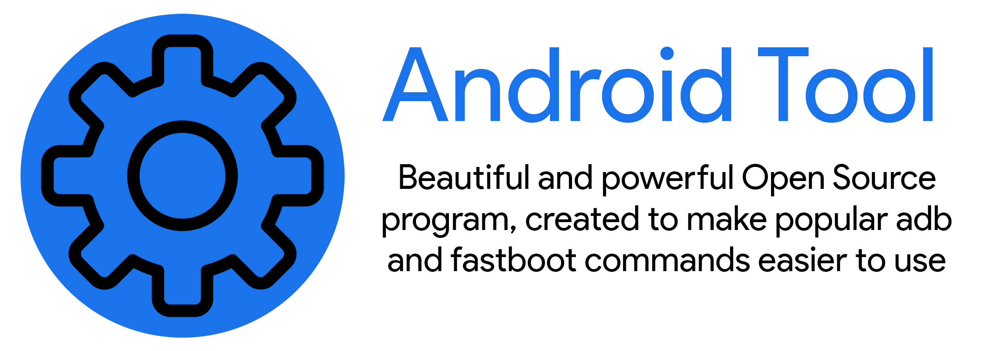

# Android Tool

## What is it?

#### Android Tool is a powerful and beautiful program, created to make popular adb and fastboot commands easier to use. A dark theme, intuitive interface and other features

## Main Features:

* #### Batch and single app installation (.apk files)
* #### Disable, enable or uninstall system apps
* #### Open, force stop or clear data of your apps
* #### Receive and save logs from your device
* #### Install or boot custom recovery or wipe partitions
* #### Save apps list
* #### Always relevant links to firmware and everything you need
* #### And not only 😉

## Screenshots
#### All screenshots can be found [here](Images/screenshots.md)

## Links:

* #### Telegram channel - [@android_tool](https://t.me/android_tooI)
* #### Telegram chat - [@android_tool_chat](https://t.me/android_tooI_chat)
* #### 4PDA thread - [Android Tool](https://4pda.to/forum/index.php?showtopic=1000362)

## The Latest Version And Updates

##### You can find the latest version on [Github Repository Releases](https://github.com/fast-geek/Android-Tool/releases)

## Usage

### First method (Recommended)

* #### Download program .jar file
* #### Open it and click "Install" button to download SDK Platform Tools
* #### Enjoy 😉

### Second method (Portable)

* #### Download a portable zip for your system
* #### Extract him
* #### Open program .jar file and enjoy 😉

## Requirements

* ##### OS (Windows (10, 8.1, 8), Linux, MacOS)
* ##### JRE (Java Runtime Environment)